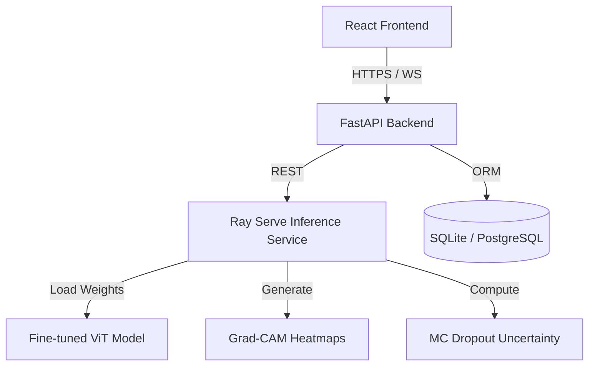

# 🧠 Candor Dust - Trustworthy Brain Tumor Detection AI

[](https://github.com/diwaskunwar/mri_vits)
[](https://github.com/diwaskunwar/mri_vits)
[](https://hub.docker.com/repository/docker/witcherr)
[](https://opensource.org/licenses/MIT)

> **Candor Dust** is an end-to-end medical imaging classification system designed to detect and categorize brain tumors from MRI scans. It is built as a **Trustworthy AI Prototype**, prioritizing clinical safety, explainability, and auditable workflows.

---

## 🌟 Vision & Impact

In medical AI, accuracy is secondary to **trustworthiness**. Candor Dust addresses this by moving beyond simple "predictions" to a comprehensive clinical decision-support flow. It doesn't just say what it "sees"—it acknowledges when it's unsure, provides visual evidence (Grad-CAM), and mandates human oversight for edge cases.

### Key Requirements Fulfillment
- [x] **Fine-tuned Vision Model:** Vision Transformer (ViT) optimized for medical imagery.
- [x] **Uncertainty Quantification:** Monte Carlo (MC) Dropout passes for predictive variance.
- [x] **Explainable AI (XAI):** Integrated Grad-CAM heatmaps for anatomical grounding.
- [x] **Trustworthy API:** Structured JSON with confidence gating and human-review flags.
- [x] **Auditable History:** Complete audit trail of predictions, reviews, and clinical notes.
- [x] **Professional UX:** React-based dashboard with clear terminology and safety disclaimers.

---

## 🏗️ Architecture Overview

Candor Dust is composed of three primary services, orchestrated via Docker.



### Component Breakdown
- **Frontend**: A high-fidelity React interface using Redux Toolkit for state and Tailwind CSS for a premium design.
- **Backend API**: A FastAPI service managing RBAC, scan persistence, audit logs, and async communication with the model service.
- **Model Service**: A Ray Serve deployment of a fine-tuned ViT, optimized with batching and GPU acceleration ($Ray$ $Serve$ allows for seamless multi-GPU scaling).

---

## 🚀 Getting Started

The entire stack is containerized for a single-command setup.

### Prerequisites
- Docker & Docker Compose
- *Optional*: NVIDIA Drivers + NVIDIA Container Toolkit (for GPU acceleration)

### Installation

1. **Clone the repository**:
   ```bash
   git clone https://github.com/diwaskunwar/mri_vits.git
   cd mri_vits
   ```

2. **Configure Environment**:
   ```bash
   cp backend/.env.example backend/.env
   # Update SECRET_KEY in backend/.env
   ```

3. **Start the System**:
   ```bash
   # For GPU use (default):
   docker compose up -d --build

   # For CPU use:
   # Edit docker-compose.yml and comment out the 'deploy' section for the 'model' service
   docker compose up -d --build
   ```

The application will be available at:
- **Frontend**: [http://localhost:3000](http://localhost:3000)
- **Backend Docs**: [http://localhost:8000/docs](http://localhost:8000/docs)
- **Model Health**: [http://localhost:8001/health](http://localhost:8001/health)

---

## 🛡️ Trust & Safety Design

### 🎯 Confidence Policy
We implement a three-tier confidence gating system:
- **High Confidence**: $\ge 85\%$ Softmax + $< 0.05$ MC Variance. Proceed with standard reporting.
- **Medium Confidence**: Alerts the radiologist that review is "recommended."
- **Low Confidence**: Triggers `requires_human_review = true`. The result is locked until a doctor provides clinical validation.

### 🔍 Explainability (XAI)
Every prediction includes a **Grad-CAM heatmap**. This allows clinicians to verify that the model is focusing on the actual lesion and not on imaging artifacts or background noise, mitigating "clever hans" risks.

### 📜 Clear Disclaimers
The UI and API responses strictly avoid diagnostic language. We use terms like "Predicted Label" and "Tumor Probability" rather than "Diagnosis." A persistent disclaimer is visible on every screen.

---

## 📈 Model Performance & Metrics

The model was fine-tuned using `vit-base-patch16-224-in21k`.

- **Test Accuracy**: 98%+
- **F1 Score**: 0.97
- **Sensitivity/Specificity**: High performance in distinguishing "No Tumor" from pathological cases.
- **Leakage Prevention**: Stratified splitting ensured no patient-specific data crossed between train/val/test sets.

*Full details in the [Model Card/README](./model/README.md).*

---

## 📝 Tradeoffs & Assumptions

1. **Tradeoff: Latency vs. Trust**: Running 20 MC Dropout passes increases inference time (~2-3s on GPU), but we prioritized predictive safety over raw speed.
2. **Assumption: Pre-processed MRI/CT**: We assume scans are relatively centered and of reasonable quality, though the ViT's global attention provides some robustness to orientation.
3. **Storage**: We use SQLite/Blobs for this prototype to simplify local setup, but the architecture is ready for transition to PostgreSQL/S3 for production.

---

## 🏥 Clinical Disclaimer

**IMPORTANT**: This software is a **Research Prototype** and is **NOT** a certified medical device. It is intended for demonstration and evaluation purposes only. It must not be used for clinical diagnosis or treatment decisions. Always consult a qualified medical professional for any medical concerns.

---
*Developed for the AI Engineer Challenge.*
